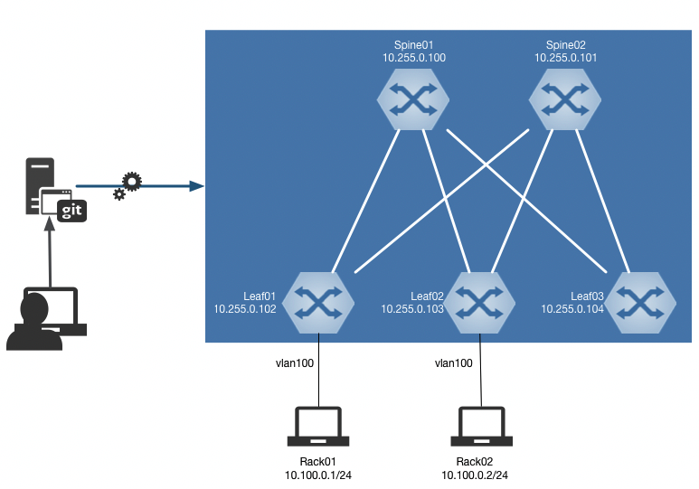

# Ansible CI/CD Meetup demo

<!-- @import "[TOC]" {cmd="toc" depthFrom=1 depthTo=6 orderedList=false} -->

<!-- code_chunk_output -->

- [ Ansible CI/CD Meetup demo](#ansible-cicd-meetup-demo)
  - [ Overview](#overview)
  - [ Content description](#content-description)
    - [ Network description](#network-description)
    - [ Ansible content](#ansible-content)
      - [ Playbooks ](#playbooks)
      - [ Device data](#device-data)
    - [ Device configuration management](#device-configuration-management)
  - [ CI/CD workflow](#cicd-workflow)

<!-- /code_chunk_output -->

## Overview

Repository provides content to support [Ansible meetup](https://www.meetup.com/Arista-Networks-Technical-Lunch-Learn/events/262517555/) run in London in July 2019 to talk about Ansible, Continuous Integration & Deployment

CI/CD approach has been built with a gitlab stack as it is an easy solution to deploy on premise. Gitlab server stack is [available](docs/gitlab-docker-stack.yml) to use with `docker-compose`. If required a more complete repository is available on [github](https://github.com/sameersbn/docker-gitlab)

Even if all configuration management use `eos_config` role from ansible, idea is not to detail how it works in detail. If you want more information, you can find [some how-tos](https://ansible-arista-howto.readthedocs.io/en/latest/?badge=latest) ([original github](https://github.com/titom73/ansible-arista-module-howto)) and on [ansible documentation](https://docs.ansible.com/ansible/latest/modules/eos_config_module.html#eos-config-module)

## Content description

To support demo, following network topology is used by Ansible



### Network description

- Management network: 10.255.0.0/24
- Underlay network block: 172.16.0.0/24 (with /31 point to point connection)
- Customer Vlans: vid 100 / 10.100.0.0/24 - vid 200 / 10.200.0.0/24

### Ansible content

#### Playbooks 

Repository comes with a set of playbooks:

- [`pb.configure.init.yml`](pb.configure.init.yml):  Playbook to load initial configuration on all EOS devices
- [`pb.configure.fabric.yml`](pb.configure.fabric.yml): Configure fabric using __non-intended method__. Just use __add__ approach
- [`pb.configure.fabric.intended.yml`](pb.configure.fabric.intended.yml): Configure fabric using __intended method__. New elements are added and non expected configurations are removed.

#### Device data

[Inventory](inventory.ini) is a static one using `ini` format listing all devices and credentials to connect:

```ini
[spine]
spine01 ansible_host=10.255.0.100
spine02 ansible_host=10.255.0.101

[leaf]
leaf01 ansible_host=10.255.0.102
leaf02 ansible_host=10.255.0.103

[all:vars]
ansible_user='ansible'
ansible_ssh_pass='ansible'
```

Data for every devices are stored in a `JSON` file per host under [host_vars](host_vars). In this demo, we are not using high level abastraction to represent topology and we focus on ansible and CI/CD implementation.

Below is a JSON snippet from [`leaf01`](host_vars/leaf01.json):

```json
{
    "hostname": "leaf01",
    "interfaces": {
        "physical": {
            "ethernet 1": {
                "key": "ethernet 1",
                "ip_address": {
                    "v4": {
                        "address": "172.16.0.1",
                        "netmask": 31
                    }
                },
                "description": "to spine01 -- et1",
                "role": "ip_address",
                "mtu": 9200,
                "speed": "auto",
                "state": "enable"
            }
        }
    }
}
```

### Device configuration management

All configuration are managed in some roles and use JINJA2 templates with [more](roles/manage-fabric/templates/device-configuration.j2) or [less](roles/base-config/templates/baseline.j2) complexity.

## CI/CD workflow

__TODO__